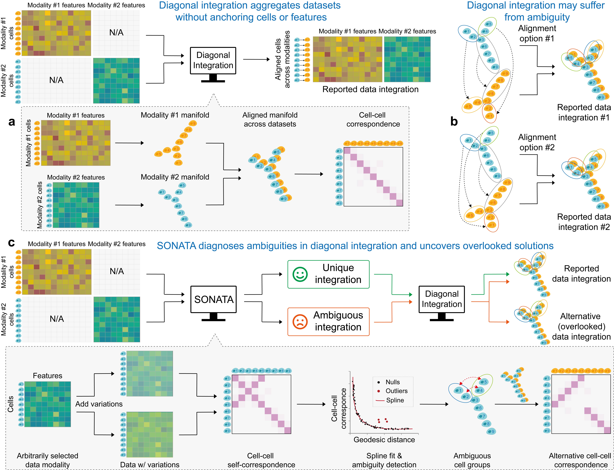

# SONATA
Source code for **SONATA: Disambiguated manifold alignment of single-cell data**  



## Requirements
Dependencies for **SONATA** are recorded in *requirements.txt*.  

## Data
Datasets are available at [this link](https://drive.google.com/drive/folders/1YWvcBaJ-yj76OjkcMz8cfKchKwuJmkGV?usp=sharing).

## Baseline Performance
All baseline method tests are implemented in the folder *src/run_baselines*. To run a test, use the following commands:
```python
cd src
python run_baselines/run_unioncom.py --dataset t_branch
```

## Examples
Jupyter notebooks to replicate the results from the manuscript are available under folder *examples*:  
- Simulation datasets
    - partial ambiguous: [simulation_t_branch.ipynb](https://github.com/batmen-lab/SONATA/blob/main/examples/simulation_t_branch.ipynb), [simulation_y_branch.ipynb](https://github.com/batmen-lab/SONATA/blob/main/examples/simulation_y_branch.ipynb), [simulation_x_branch.ipynb](https://github.com/batmen-lab/SONATA/blob/main/examples/simulation_x_branch.ipynb)
    - no ambiguous: [simulation_decay_path.ipynb](https://github.com/batmen-lab/SONATA/blob/main/examples/simulation_decay_path.ipynb)
- Real biology datasets
    - scGEM: [scGEM.ipynb](https://github.com/batmen-lab/SONATA/blob/main/examples/scGEM.ipynb)
    - SNARE: [SNARE.ipynb](https://github.com/batmen-lab/SONATA/blob/main/examples/SNARE.ipynb)


## Basic Use
Input for SONATA: 
 - **params**: A dictionary containing the following keys:
    - **scot_k**, **scot_e**, **scot_mode**, **scot_metric**: Parameters for manifold aligners. Refer to the SCOT tutorial for guidance on setting these parameters.
    - **n_cluster**:Number of cell groups used in hierarchical clustering to achieve a smooth and efficient spline fit. Recommended: n_cluster <= $\sqrt{n\_samples}$. Default: 20.
    - **noise_scale**: The scale of gaussian noise added to generate variational versions of the manifold. Default: 0.2.
    - **elbow_k_range**: The range of constrained cluster numbers used by the elbow method to determine the optimal cluster count. Default: 11.
 - **data**: A NumPy array or matrix where rows correspond to samples and columns correspond to features.

```python
import sonata
sn = sonata.sonata(params)
ambiguous_labels, ambiguous_idx = sn.diagnose(data)
```
For an example, please refer to the cfg file under folder *examples/cfgs*.


## Major Updates
- **Nov. 2, 2024**: We have released the source code for new version of SONATA.
- **Nov. 1, 2024**: We have added more comprehensive tests for 5 baseline methods, which can be found in the *src/run_baselines* folder. We're also working on the new version of SONATA—coming soon! 